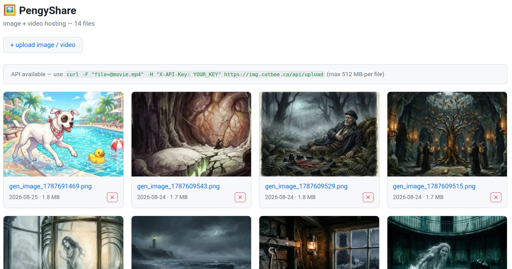

# PengyShare

A self-hosted image **and video** hosting service. Upload a photo or a GoPro clip, get a short shareable URL — paste the direct link into Discord, Google Chat, or any chat for an inline preview.

## Screenshot



The mixed gallery — image cards sit alongside video cards (poster frame + play badge).

## Features

- Upload **images** (`jpg`, `jpeg`, `png`, `gif`, `webp`, `bmp`, `tiff`, `svg`) and **videos** (`mp4`, `mov`, `m4v`, `webm`, `mkv`)
- Short 5-character unique URLs (e.g. `https://img.example.com/a3f9c`)
- **Direct media URLs** (`/img/<slug>`) for embedding — videos serve with HTTP **Range/206** so they seek and preview inline in Discord / Google Chat / browsers
- Auto thumbnails: 300px WebP for images, an **ffmpeg poster frame** for videos
- **OpenGraph `og:video` / `og:image`** meta on view pages → rich link cards with a play button
- Mixed gallery with video play badges
- API with key authentication + IP-restricted web uploads — safe to expose publicly
- Unlisted media (accessible by URL, hidden from the gallery)
- Configurable storage directory (point it at a NAS mount), `BASE_URL` for a reverse proxy
- CORS on API endpoints + health check endpoint

## Requirements

- Python 3.10+
- pip dependencies (see `requirements.txt`)
- **Pillow** (optional but recommended — image thumbnail generation)
- **ffmpeg** (required for video poster thumbnails)

## Installation

```bash
git clone https://github.com/patw/PengyShare
cd PengyShare
pip install -r requirements.txt
```

## Running

```bash
python app.py      # starts on :5003 (or PORT)
# or use pengyshare.sh, which creates/syncs a .venv then runs app.py
```

PengyShare runs on a single Flask process. For heavier loads put it behind something like nginx + uvicorn/gunicorn, but for a personal share box the built-in server is fine.

## Configuration

All settings are read from environment variables or a `.env` file in the project root.

| Variable | Default | Description |
|---|---|---|
| `BASE_URL` | `http://localhost:5001` | Public base URL used in all generated links |
| `IMAGES_DIR` | `./images` | Directory where media + the moofile store live (can point at a NAS) |
| `MAX_IMAGE_SIZE` | `536870912` (512 MB) | Max upload size in bytes |
| `ALLOWED_EXTENSIONS` | `jpg,jpeg,png,gif,webp,bmp,tiff,svg,mov,mp4,m4v,webm,mkv` | Comma-separated allowed media extensions |
| `IMAGES_PER_PAGE` | `50` | Media shown on the index page |
| `API_KEY` | *(empty)* | API key required for `/api/upload` (leave empty to disable API) |
| `ALLOWED_POST_CIDR` | `127.0.0.1/32` | Comma-separated CIDRs allowed to upload/delete via the web UI |
| `FFMPEG_PATH` | `ffmpeg` | Path to the ffmpeg binary (video posters) |
| `DEBUG` | `false` | Flask debug mode |
| `HOST` | `0.0.0.0` | Bind address |
| `PORT` | `5001` | Bind port |

Example `.env`:

```ini
BASE_URL=https://img.example.com
IMAGES_DIR=/mnt/nas/media
MAX_IMAGE_SIZE=536870912
API_KEY=your-generated-api-key-here
ALLOWED_POST_CIDR=10.0.0.0/8,192.168.0.0/16
```

Generate an API key:

```bash
python3 -c "import secrets; print(secrets.token_urlsafe(32))"
```

## API

All API endpoints support CORS. Auth is via `X-API-Key: <key>`, `Authorization: Bearer <key>`, or `api_key=<key>` query param.

### `GET /health`

Health check. Returns the service name, `IMAGES_DIR`, and whether it's writable.

### `POST /api/upload`

Upload an image or video. The file field may be named `file`, `image`, or `video`.

```bash
curl -s https://img.example.com/api/upload \
  -H "X-API-Key: your-api-key" \
  -F "file=@movie.mp4" \
  -F "unlisted=false"
```

**Response (`201`):**

```json
{
  "ok": true,
  "slug": "a3f9c",
  "kind": "video",
  "url": "https://img.example.com/a3f9c",
  "direct_url": "https://img.example.com/img/a3f9c",
  "thumb_url": "https://img.example.com/thumb/a3f9c",
  "filename": "movie.mp4"
}
```

`kind` is `image` or `video`.

### `GET /api/info/<slug>`

Return metadata for one slug (size, hash, mime, kind, created_at, embed URLs).

### `POST /api/delete/<slug>`

Delete a media item. Requires a valid API key.

### Web routes

| Route | Description |
|---|---|
| `GET /` | Gallery (latest public media, newest first) |
| `GET /upload` | Upload form (POST posts a file + optional unlisted) |
| `GET /<slug>` | View page — `<video>` player for videos, `` for images, with embed codes |
| `GET /img/<slug>` | Direct media bytes (Range/206 enabled) |
| `GET /thumb/<slug>` | 300px thumbnail / poster (WebP) |
| `GET /<slug>/download` | Force-download the original |
| `POST /<slug>/delete` | Delete (IP-restricted) |

## Sharing

- **Images:** page URL, direct `/img/<slug>`, or Markdown/HTML embed.
- **Videos:** the **page URL** (`/a3f9c`) gives an HTML player; the **direct URL** (`/img/a3f9c`) is what you paste into Discord / Google Chat for an inline embed.
- **Codec caveat:** raw `.mp4` (H.264/AAC) previews everywhere. A GoPro `.mov` may contain HEVC/H.265, which downloads but may **not** preview inline in Discord/browsers — for guaranteed inline previews, keep clips as H.264 `.mp4`.

## Storage layout

```
images/
  images.bson         ← moofile document store (metadata, incl. kind)
  images.bson.meta    ← moofile index config
  <slug>.ext          ← uploaded media (e.g. a3f9c.mp4)
  <slug>.thumb.webp   ← generated thumbnail / poster
```

Uploaded files are stored as-is (`<slug><ext>`); metadata (slug, filename, mime, size, hash, `kind`, unlisted, created_at) lives in the embedded [moofile](https://github.com/patw/moofile) collection inside the same directory.

## Deploy (systemd + nginx)

A combined `pengyshare.service` + `img.catbee.ca.nginx` example is included. Key nginx notes for large videos:

```nginx
location / {
    proxy_pass http://127.0.0.1:5003;
    proxy_buffering off;               # stream video out
    proxy_set_header X-Real-IP $remote_addr;
    proxy_set_header X-Forwarded-For $proxy_add_x_forwarded_for;
}
client_max_body_size 600M;             # must exceed MAX_IMAGE_SIZE
client_body_timeout 600s;
```

## License

MIT — see [LICENSE](LICENSE).
